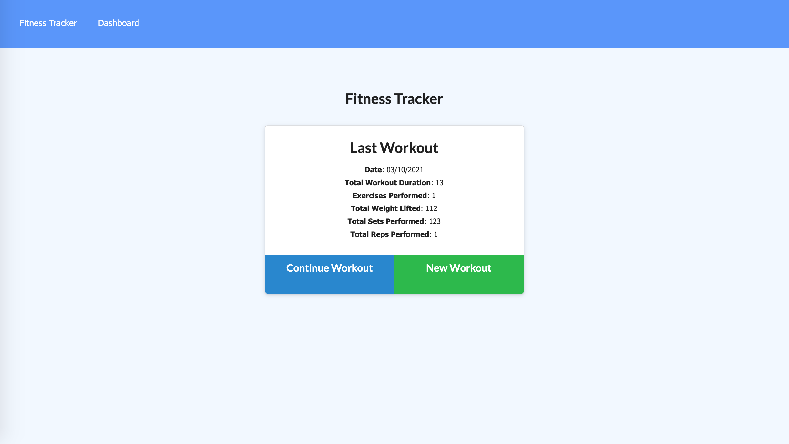

# Workout Tracker

## Description
This is a full-stack workout tracker featuring mongoDB / Mongoose. It allows you to add exercises to workouts, which are then aggregated into graphs. 

See deployed app [here](https://protected-tor-62513.herokuapp.com/).

## Table of Contents 
* [Technology](#technology)
* [Installation](#installation)
* [Usage](#usage)
* [License](#license)
* [User Story](#user-story)
* [Acceptance Criteria](#acceptance-criteria)
* [Questions](#questions)

## Technology 
Starter code was provided for front-end, and I had to build all the backend routes with the following tech:
* Node.js
* Express
* mongoDB
* Mongoose

## Installation
If you want to run this locally on your machine:
* Clone / fork to your local machine
* Type npm i on your terminal to install all dependencies
* Type npm run seed to seed the database
* Type npm start to run the application
* Go to http://localhost:3000/ to use the application

## Usage
See deployed app [here](https://protected-tor-62513.herokuapp.com/)

1. If there is an existing workout, you can either add exercises to it (by pressing Continue) or create a new workout altogether
2. When you are adding exercises, you can either choose cardio / resistance training
3. Once you submit your exercise, you can either add more exercises, complete your workout
4. Once you complete your workout, you will be taken to a summary page summarising your last workout
5. You can also click to the Stats page and be taken to a page with two graphs, summarising workout duration and weight lifted over the past 7 workouts

## License
This project uses MIT license.

## User Story

* As a user, I want to be able to view create and track daily workouts. I want to be able to log multiple exercises in a workout on a given day. I should also be able to track the name, type, weight, sets, reps, and duration of exercise. If the exercise is a cardio exercise, I should be able to track my distance traveled.

## Acceptance Criteria

When the user loads the page, they should be given the option to create a new workout or continue with their last workout.

The user should be able to:

  * Add exercises to the most recent workout plan.

  * Add new exercises to a new workout plan.

  * View the combined weight of multiple exercises from the past seven workouts on the `stats` page.

  * View the total duration of each workout from the past seven workouts on the `stats` page.

## Questions
For any further questions, reach out to rpgarde@gmail.com or visit my [Github profile](https://github.com/rpgarde).